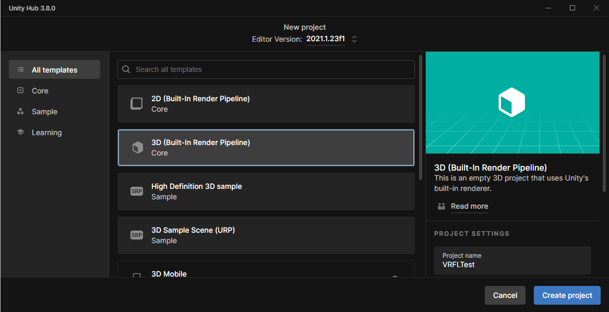
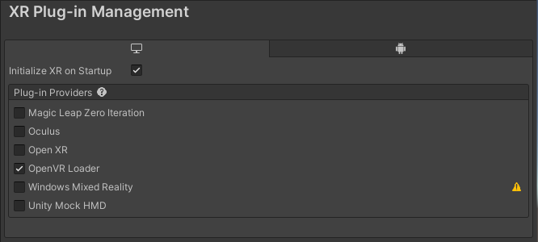
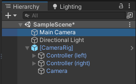
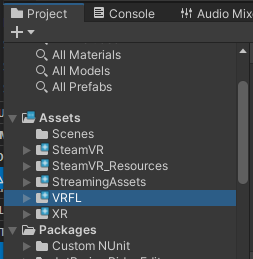
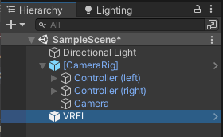
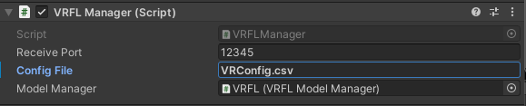
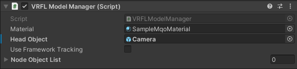

# Vive 設定チュートリアル

## 1. ビューワ(Unity)の Vive 対応

Unityで作成するビューワをHMD(Vive)対応にする方法について以下に順を追って解説を行います。

### 1-1. Unity プロジェクトの作成

UnityHubから新しくUnityプロジェクトを作成します。
作成する際のテンプレートは3D(Built-In Render Pipeline)を選択して下さい。
(このチュートリアルではUnity 2021.1.23f1を利用します。環境によって手順が変わる可能性が有りますのでご注意ください)

### 1-2. SteamVR のインストール

UnityのAssetStoreからSteamVR Pluginをインストールして下さい。

### 1-3. ProjectSettings の設定

Unityのメインメニューから Edit → ProjectSettingsを開いてください。
XR Plug-in Managementを選択して “OpenVR Loader”にチェックが入っている事を確認して下さい。

### 1-4. CameraRig の追加

ProjectのAssets/SteamVR/Prefabsにある[Camera Rig]をドラッグ&ドロップでシーンに追加して下さい。

### 1-5. 既存カメラの削除

既存のカメラは不要なので、Hierarchyから”Main Camea”を削除して下さい。

### 1-6. VRFL の追加

“VRFL.unitypackage”をドラッグ&ドロップでProjectのAssetに追加して下さい。

### 1-7. VRFL のシーンへの追加

ProjectのAssets/VRFL/Prefabsから”VRFL”をシーンに追加して下さい。

### 1-8. VRFL Manager の設定

HierarchyのVRFLを選択してInspectorで設定を行います。
ReceivePortにはUnity側の受信ポート番号。ConfigFileには設定ファイル名を設定して下さい。
ポート番号はVIsualStudio側の設定(VRFL::Initialize)と合わせるように。
設定ファイルは実行ファイル(又はUnityプロジェクトのルートフォルダ)からの相対パスで記述して下さい。

### 1-9. VRFL Model Manager の設定

HeadObjectに(4)で追加した[CameraRig]の下にある”Camera”を設定して下さい。
“UseFrameworkTracking”がoffの場合はHMDのトラッキングに従ってカメラが動きます。
(通常のHMDと同じ)
onの場合はフレームワーク(VisualStudio)側から送信されるカメラの情報に基づいてカメラが動くようになります。

