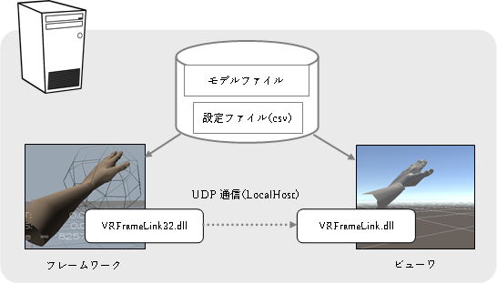
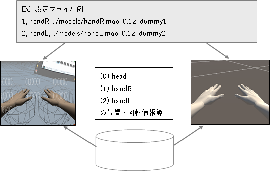
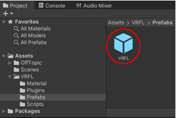
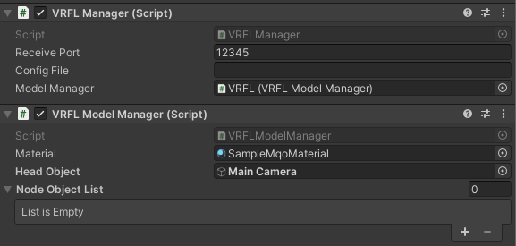

# VRFrameLink モジュール

VRFrameLink モジュールは、シミュレーションを行うフレームワークと Unity の間を通信によって仲介して、フレームワークでのシミュレーション結果を Unity 上に反映させるためのモジュールです。

## 1. VRFrameLink モジュール構成

下図はシステム全体の構成図です。



1. VRFrameLink_Sample (VisualStudio, C++)  
   シーングラフを持つVRシミュレーション本体のサンプルプロジェクト。  
   VRFrameLink(32).dll による通信を介してビューワにシーングラフ情報を送信し、シーンの同期を行います。

2. ビューワ (Unity, C#)  
   フレームワークからシーングラフの情報を受信、設定ファイルの情報も含めてフレームワーク上のシーンを再現します。

3. VRFrameLink (VisualStudio, C++)  
   シーングラフの情報を送受信する仲介モジュール。  
   VRFrameLink(32).dll としてビルドされ、VRFrameLink_Sample から呼び出されます。  
   データの送受信はローカルの UDP 通信を介して行われます。

4. 設定ファイル(csv)  
   [２章](#2-設定ファイル)にて詳述。

5. モデルファイル(mqo, obj)  
   Metasequoia / OBJ 形式のモデルファイル。または、OBJ 形式の連番ファイル。

## 2. 設定ファイル

### 2-1. 設定ファイルの内容

フレームワークとビューワで共有するオブジェクトに関する情報を記述した設定ファイル(csv)。
このファイルには以下の情報をオブジェクト毎に１列、カンマ区切りで記述します。

| 型     | 内容                                 |
| ------ | ------------------------------------ |
| 整数   | オブジェクトID（> 0）                |
| 文字列 | オブジェクト名称                     |
| 文字列 | 対応するモデルファイル名             |
| 数値   | モデルを読み込む際のスケール値       |
| 文字列 | 属性の記述（記述例：Sequence=true;） |

フレームワークとビューワは同じ設定ファイルを読込みます。
オブジェクト ID(名称)をキーにしてフレームワークはオブジェクトの状態を送信、ビューワはそれを受信して表示するシーンに反映する事でシーンの同期を実現します。



オブジェクト ID の 0 番は "head"（カメラ）の為の予約番号です。
フレームワークは設定ファイルに head の定義があるかどうかにかかわらず、0 番として head の情報を送信する必要が有ります。
又、設定ファイルに 0 番として head 以外の設定を書き込む事は NG です。

属性の記述はオブジェクト毎に任意の数を記述できます。属性の記述は "属性名=属性値;" の形式で記述します。

### 2-2. 連番 obj ファイルの指定

連番の obj ファイルを指定する場合は、モデルファイル名の部分に、連番を表す "%i" を記述して、以下の属性を追加してください。

- Sequence : true を指定すると、連番ファイルとして扱われます。
- FPS : 連番ファイルの再生速度を指定します。単位はフレーム/秒です。
- FrameCount : 連番ファイルのフレーム数を指定します。
- ReuseMaterial : true を指定すると、連番ファイルの全てのフレームで最初のフレームのマテリアルを使用します。これを指定しない場合は、フレーム毎にマテリアルが生成されます。

```csv
1,heart,heart_%i.obj,0.01,Sequence=true;FPS=30;FrameCount=30;ReuseMaterial=true;
```

## 3. Unity 側の準備

### 3-1. プロジェクトへの組み込み

Unity のプロジェクトを作成してパッケージ "VRFL.unitypackage" をドラッグ&ドロップで
Unity のプロジェクトに追加して下さい。

### 3-2. VRFL のシーンへの追加

パッケージの組込みで Project の Assets フォルダに "VRFL" フォルダが追加されます。
この中から "VRFL/Prefabs/VRLF.prefab" をドラッグ&ドロップでシーンに追加して下さい。



### 3-3. VRFL の設定

追加した Prefab に追加されているスクリプトに設定を記入して下さい。

- RecievePort : VRFL からデータを受信するポート番号  
  フレームワーク側の `VRFL::InitializeSim()` に指定するポート番号と同一

- Config File : 設定ファイル名  
  Editor のルートフォルダ、又は実行ファイルのあるフォルダからの相対パスで記述。空欄の場合は "VRConfig.csv" が使われます。

- MainCamera : シーン中の描画用カメラ



## 4. フレームワーク側の実装

### 4-1. プロジェクトへの組み込み

作成したプロジェクトを右クリック > 追加 > 参照 > VRFrameLink を選択してください。

または、プロジェクトにヘッダーファイル "VRFLInterface.h"、スタティックリンクライブラリに "VRFrameLink(32).lib" を追加して下さい。
実行時には exe ファイルと同じフォルダに "VRFrameLink(32).dll" を置いて下さい。

なお、VRFrameLink_Sample ではプロジェクトルートの VRConfig.csv をビルド後のイベントで出力フォルダにコピーするように設定しています。

### 4-2. フレームワークで使用する関数

#### 設定ファイルの読み込み

- filename : 設定ファイル名
- relativebase : 相対パスの基準となるフォルダの設定
- 戻り値 : 設定ファイル読込成否  
  filename が絶対パスの場合は直接ファイルを読み込みます。設定されていない場合は暗黙
  に "./VRConfig.csv" がセットされます。
  Filename が相対パスの場合、relativebase に値が設定されていればそのフォルダを基準に、
  無ければ実行ファイルがあるフォルダを基準に検索されます。

```cpp
bool LoadConfig(const char* filename, const char* relativebase);
```

#### 設定数の取得

- 戻り値 : 設定数(オブジェクト数)

```cpp
int GetConfigCount();
```

#### GetConfig 中に取得する文字列の最大の長さを取得する

- 戻り値 : 最長文字列の長さ

```cpp
int GetMaxStringLength();
```

#### 設定ファイルの内容を取得する

- index : 取得するデータの番号(csv ファイル内の行番号)
- id : オブジェクトの番号
- scale : オブジェクトに掛けるスケール値
- node : シーングラフ内のノード名
- file : モデルファイル等のファイル名
- charsize : node, file 取得用バッファのサイズ

```cpp
bool GetConfig(int index, int* id, float* scale, char* node, char* file, int charsize);
```

#### シミュレーションの初期化(Unity との接続)

- remoteport : Unity 側の待ち受けポート番号

```cpp
bool InitializeSim(unsigned short remoteport);
```

#### フレームワーク（VisualStudio）側のシーングラフ情報を Unity に送信する

- pObjDataT : 送信する ObjDataT 列の先頭ポインタ
- length : 送信する ObjDataT の数

```cpp
void Send(void** pObjDataT, int length);
```

### 4-3. フレームワーク側の処理の流れ

フレームワーク側は下記の流れで処理を実行します。

1. `VRFL::Initialize(ポート番号)`  
   VRFL の初期化を行います。Unity の受信用ポート番号を指定して、送信準備を行います。
2. `LoadConfig(ファイル名)`  
   設定ファイル(csv)を読み込みます
3. `GetConfigCount()`, `GetID()`, `GetFileName()`, `GetScale()`  
   これらの関数を利用して設定ファイルからデータを読込みます。又、それらからモデルファイル等の準備を行います。
4. `Send()`  
   (3)までの準備が完了したら、以降シーンが更新される毎(idle 関数が呼ばれる毎)に `Send()` 関数でオブジェクトの情報を Unity に送信します。
